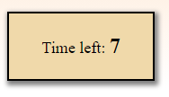

# &lt;countdown-timer&gt;

A web component that represents a countdown timer.

## Attributes

### `time`

A string attribute, if present, that contains the time in seconds set to the timer.

Default value: 20 seconds.

## Methods

### `startTimer()`

A method that starts the timer.

#### Example

```javascript
// Bind the countdown-timer element to a constant.
const timer = document.querySelector('countdown-timer')
// Start the timer.
timer.startTimer() 
```

### `get timeToFinish`
 
Get the time it took from start to stop.

#### Example

```javascript
// Get the time that is left on the timer.
const timeLeft = countdown-timer.timeLeft
console.log(timeLeft) // Output example: 10
```

## Custom Events

### `timeOut`

When the timer reaches 0.

#### Example

```javascript
document.addEventListener('timeOut', function(){
    /*Handle event here*/
})
or
// implement the function outside the event listener.
document.addEventListener('timeOut', () => function())
```

## Example

```html
<countdown-timer time="15"></countdown-timer>
```


