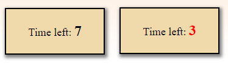

# &lt;countdown-timer&gt;

A web component that represents a countdown timer.

## Attributes

### `time`

A string attribute representing the time in seconds set for the timer.

Default value: 20 seconds.

## Methods

### `startTimer()`

Starts the countdown timer and updates the display every second.

#### Example

```javascript
// Bind the countdown-timer element to a constant.
const timer = document.querySelector('countdown-timer')
// Start the timer.
timer.startTimer() 
```

### `get timeToFinish`
 
Get the time it took from start to stop.

#### Example

```javascript
// Get the time it takes from the start/limit until it stops.
const timeLeft = countdown-timer.timeLeft
console.log(timeLeft) // Output example: 10. (example if the start/limit is 15 and the timer stops at 5sec left.)
```

## Custom Events

### `timeOut`

When the timer reaches 0.

#### Example

```javascript
document.addEventListener('timeOut', function(){
    /*Handle event here*/
})
or
// implement the function outside the event listener.
document.addEventListener('timeOut', () => function())
```

## Example

```html
&lt;countdown-timer time="15"&gt;&lt;/countdown-timer&gt;
```


