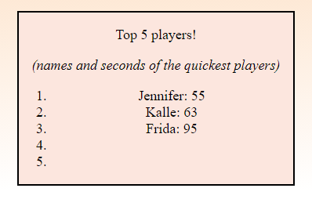

# &lt;high-score&lt;

A web component that represents a high-score list of the top 5 players.

## Methods

### `buildList(listObject)`

A method that takes an object with all players and their scores and builds a high-score list with the top 5 players.

#### Parameters
 - `listObject` (object): An object containing player nicknames and scores.

#### Example
```javascript
const playerList = {
    Kalle: '63',
    Jennifer: '55',
    Frida: '95',
    Sabrina: '50',
    // ...
}

high-score.buildList(playerList)
```

## Example

```html
<high-score></high-score>
```

