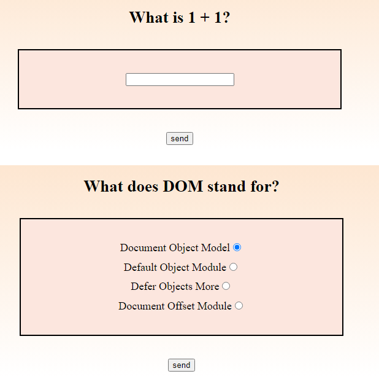

# &lt;quiz-question&gt;

A web component that represents quiz questions and/or answers.

## Methods

### `showQuestion(object)`

A method that takes an object with a question and none or several answer alternatives and renders them for the user to choose/write.
 - No answer: writing input, user cannot see any answers.
 - Multiple answer alternatives: radio dials to choose from all the alternatives.

#### Parameters
- `object` (object): An object containing a question and none or multiple answer alternatives.

#### Example
```javascript
const question = {
    question: 'Can pigs fly?',
    alt1: 'Yes',
    alt2: 'No',
    alt3: 'Yes, but only on a plane',
    // ...
}

// Call the method with the example object
quiz-question.showQuestion(question)
```

### `get answer()`

Gets the answer the user gave for the question.

#### Example
```javascript
// Get the answer the USER gave, it does not validate if the answer is correct or not.
const answer = quiz-question.answer
console.log(answer) // Output example: alt2: 'no'
```

## Example

```html
<quiz-question></quiz-question>
```
The first is the layout for a question with no answer alternatives sent and the second for a question with multiple answer alternative


